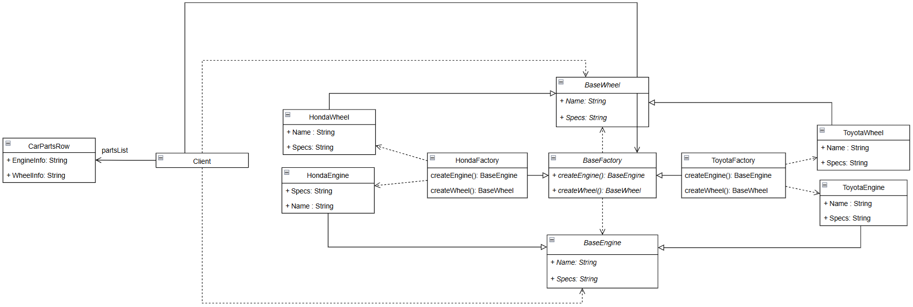

# Lab01

## Описание проблемы:

На станции технического обслуживания для проведения ТО необходимо подбирать совместимые запчасти для разных марок автомобилей. Каждая марка требует использования специфических деталей, которые не являются взаимозаменяемыми.

> _ВААУ, ВЫ ПОСМОТРИТЕ КАК ЭТА СНОСКА КРУТО ВЫГЛЯДИт_

Появляется необходимость в удобном ПО, в котором будет список деталей для каждого производителя (или марки авто), чтобы, к примеру, механик-новичок, не имеющий достаточных теоретических и практических, мог подобрать правильные детали для нужного автомобиля.

## Решение

Для решения проблемы используется паттерн `Abstract Factory`. 

Паттерн предоставляет интерфейс для создания семейств взаимосвязанных объектов (двигатель и колёса), не специфицируя их конкретные классы. Каждая фабрика соответствует определённому производителю автомобилей и гарантирует создание совместимых деталей. 

Выбор конкретной фабрики делегируется клиентскому коду на основе выбранной марки автомобиля. Основная программа работает только с абстрактными классами (`BaseEngine`, `BaseWheel`), не завися от конкретных реализаций. 

Таким образом, система гарантирует, что все созданные детали будут совместимы в рамках одного производителя, а добавление новой марки автомобилей потребует минимальных изменений в коде.

Диаграмма классов:

Базовая фабрика определяет абстрактные методы `createEngine()` и `createWheel()`, которые переопределяются в конкретных фабриках для создания соответствующих деталей.

## Реализация

Проект реализован на языке `C#`. 

## Вывод

Паттерн `Abstract Factory` внедрен успешно
