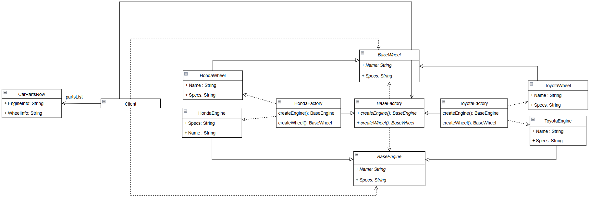

# Lab01

## Описание проблемы:

На станции технического обслуживания для проведения ТО необходимо подбирать совместимые запчасти для разных марок автомобилей. Каждая марка требует использования специфических деталей, которые не являются взаимозаменяемыми.

> _ВААУ, ВЫ ПОСМОТРИТЕ КАК ЭТА СНОСКА КРУТО ВЫГЛЯДИт_

Появляется необходимость в удобном ПО, в котором будет список деталей для каждого производителя (или марки авто), чтобы, к примеру, механик-новичок, не имеющий достаточных теоретических и практических, мог подобрать правильные детали для нужного автомобиля.

## Решение

Для решения проблемы используется паттерн `Abstract Factory`. 

Паттерн предоставляет интерфейс для создания семейств взаимосвязанных объектов (в моем случае это двигатель и колеса). Каждая фабрика соответствует определённому производителю автомобилей и гарантирует создание совместимых деталей.   

Выбор фабрики производится на основе выбранной марки автомобился. Программа работает только с абстрактными классами (`BaseEngine` и `BaseWheel`) и не зависит от конкретных реализаций. 

Таким образом, есть гарантия того, что все детали будут совместимы в рамках одного производителя, а для добавления новой марки автомобиля не потребует больших изменений в коде.

Диаграмма классов:

Базовая фабрика определяет абстрактные методы `createEngine()` и `createWheel()`, которые переопределяются в конкретных фабриках для создания соответствующих деталей.
