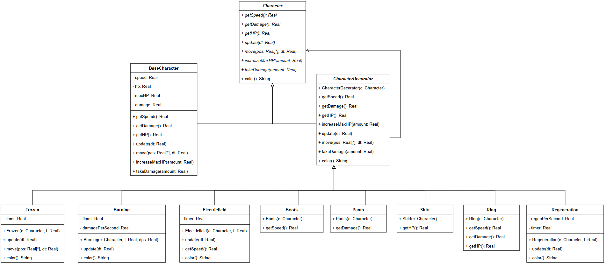
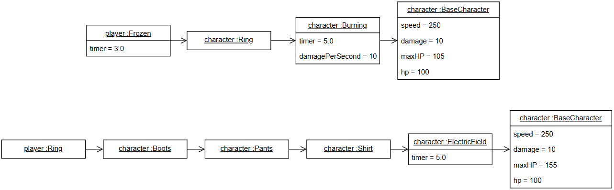
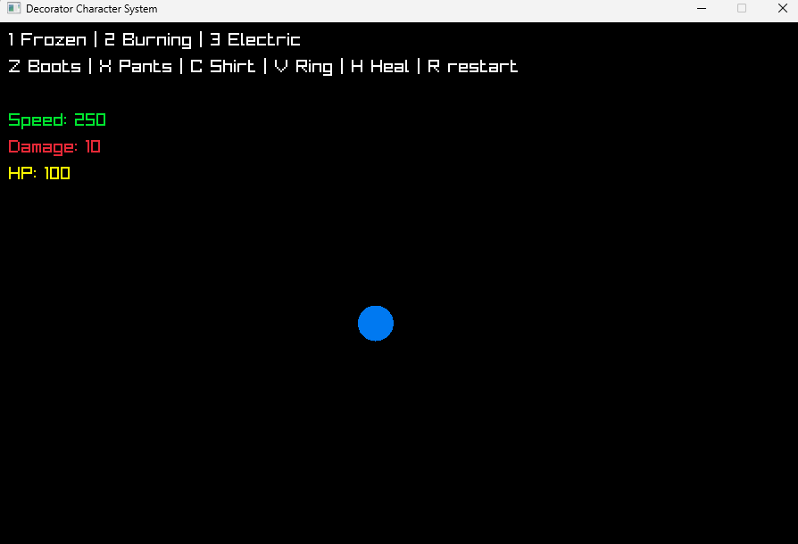

# Лабораторная работа №4
## Паттерн: Декоратор (Decorator)
### Описание
**Проблема:** в игре необходимо динамически обновлять свойства и состояния у персонажа. При наследовании пришлось бы создавать огромное количество подклассов для каждой комбинации эффектов и состояний персонажа, что делает код нагруженным и маломасштабируемым.

**Решение:** решением является паттерн декоратор. Он позволяет динамически обновлять объект. Вместо создания новых подклассов для каждой комбинации эффектов, система динамически оборачивает базового игрока в декораторы, каждый из которых добавляет свою функциональность. 

___
### Реализация
На рисунке 1 изображена диаграмма классов паттерна декоратор
_Рисунок 1 - диаграмма классов_  
На рисунке 2 изображены 2 диаграммы объектов
_Рисунок 2 - диаграмма объектов_  

На верхней диаграмме происходит следующее:
- BaseCharacter - создается базовый персонаж (speed = 250, damage = 10, hp = 100, maxHP = 100)
- Burning - накладывается дебафф "горение" на 5 секунд и наносит 10 единиц урона в секудну
- Ring - надевается кольцо добавляет бонус к характеристикам персонажа и повышает maxHP до 105
- Frozen - накладывается дебафф "заморозка", который длится 3 секунды (останавливает персонажа)

На нижней диаграмме:
- Создается базовый персонаж(speed = 250, damage = 10, hp = 100, maxHP = 100)
- Накладывается дебафф "электрическое поля" на 5 секунд (замедляет персонажа)
- Надевается футболка, которая добавляет бонус к характеристикам персонажа (увеличение HP) и повышает maxHP до 150
- Надеваются штаны, которые добавляют бонус к характеристикам персонажа (увеличение урона)
- Надеваются ботинки, которые добавляют бонус к характеристикам персонажа (увеличение скорости)
- Ring - надевается кольцо добавляет бонус к характеристикам персонажа и повышает maxHP до 155

___
Класс `Character` является абстрактным, в будущем его методы будут переопределяться. В нем содержатся основные методы, с помощью которых мы будем "оборачивать" нашего игрока в эффекты:

```cpp
class Character
{
public:
    	virtual float getSpeed() = 0;
    	virtual float getDamage() = 0;
    	virtual float getHP() = 0;
    
    	virtual Color color() { return BLUE; }
    
    	virtual void increaseMaxHP(float amount) = 0;
    
    	virtual void update(float dt) = 0;
    	virtual void move(Vector2& pos, float dt) = 0;
    	virtual void takeDamage(float amount) = 0;
    
    	virtual ~Character() {}
};
```
---
Класс `BaseCharacter` является базовой реализацией игрока. Она представляет объект, который может быть дополнен декораторами В нем переопределяются и реализуются все основные методы, такие как `move`, `increaseMaxHP` и `takeDamage`, которые отвечают за передвижение, увеличение максимального уровня здоровься и получение урона соответственно.
```cpp
class BaseCharacter : public Character
{
private:
	    float speed = 250, hp = 100, maxHP = 100, damage = 10;

public:
    	float getSpeed() override { return speed; }
    	float getDamage() override { return damage; }
    	float getHP() override { return hp; }
    
    	void update(float dt) override {}
    
    	void move(Vector2& pos, float dt) override
    	{
    		if (IsKeyDown(KEY_W))
    			pos.y -= speed * dt;
    		if (IsKeyDown(KEY_S))
    			pos.y += speed * dt;
    		if (IsKeyDown(KEY_A))
    			pos.x -= speed * dt;
    		if (IsKeyDown(KEY_D))
    			pos.x += speed * dt;
    	}
    
    	void increaseMaxHP(float amount) override
    	{
    		maxHP += amount;
    		hp += amount;
    		if (hp > maxHP)
    			hp = maxHP;
    	}
    
    	void takeDamage(float amount) override
    	{
    		hp -= amount;
    		if (hp > maxHP)
    			hp = maxHP;
    	}
};
```
---
Класс `CharacterDecorator` является базовым классом для декораторов. Здесь мы предоставляем всё необходимое для создания будущих декораторов. 
> Декоратор хранит только указатель на объект `Character`
```cpp
class CharacterDecorator : public Character
{
protected:
	    Character* character;
public:
    	CharacterDecorator(Character* c) : character(c) {}
    
    	virtual ~CharacterDecorator() { delete character; }
    
    	float getSpeed() override { return character->getSpeed(); }
    	float getDamage() override { return character->getDamage(); }
    	float getHP() override { return character->getHP(); }
    
    	void increaseMaxHP(float amount) override { character->increaseMaxHP(amount); }
    
    	void update(float dt) override { character->update(dt); }
    
    	void move(Vector2& pos, float dt) override
    	{
    		float speed = getSpeed();
    
    		if (IsKeyDown(KEY_W))
    			pos.y -= speed * dt;
    		if (IsKeyDown(KEY_S))
    			pos.y += speed * dt;
    		if (IsKeyDown(KEY_A))
    			pos.x -= speed * dt;
    		if (IsKeyDown(KEY_D))
    			pos.x += speed * dt;
    	}
    
    	void takeDamage(float amount) override { character->takeDamage(amount); }
    
    
    	Color color() override { return character->color(); }
};
```
---
Пример декоратора на примере эффекта `Burning`:

```cpp
class Burning : public CharacterDecorator
{
    float timer, damagePerSecond; 

public:
	    Burning(Character* c, float t, float dps) : CharacterDecorator(c), timer(t), damagePerSecond(dps) {} //инициализируем параметры эффекта: время действия и урон в секунду

    	void update(float dt) override //обновляем состояния базового персонажа
    	{
    		character->update(dt);
    
    		if (timer > 0)
    		{
    			character->takeDamage(damagePerSecond * dt / 2); //ДЕЛАЕМ УРОН ПО ПЕРСОНАЖУ ЖОСКИИИЙ
    			timer -= dt;
    		}
    	}
    
    	Color color() override //меняем цвет во время действия персонажа
    	{
    		if (timer > 0)
    			return ORANGE;
    		return character->color();
    	}
};
```
Сама игра реализована с помощью внешней библиотеки Raylib
___
### Игра
На рисунке 3 представлен вид игры
_Рисунок 3 - Вид игры_  

Персонаж представлен в виде синего круга, который может передвигаться в любую сторону.
___
### Реализация без паттерна
В реализации без паттера был определен абстрактный класс `Effect`, в котором определяются основные методы для создания эффектов.

Все времменные эффекты хранятся в вектор-массиве `activeEffects`, который изначально пуст. При активации эффекта добавляется новый экземпляр объекта соответствующего класса эффекта.
```cpp
        <...>
        void applyFrozen(float time) {
            activeEffects.emplace_back(make_unique<FrozenEffect>(time));  
        }
        
        void applyBurning(float time, float dps) {
            activeEffects.emplace_back(make_unique<BurningEffect>(time, dps));
        }
        <...>
```
Каждый экземпляр содержит собственный таймер длительности и параметры.

```cpp
class Effect 
{
public:
    float timer;  // 👈 Общий таймер для всех эффектов
    <...>
};

<...>
class BurningEffect : public Effect {
public:
    float damagePerSecond;
    
    BurningEffect(float t, float dps) : damagePerSecond(dps) {
        timer = t;
    }
    <...>
};
```
При истечении таймера, эффект удаляется из вектор-массива.
```cpp
void update(float dt) override {
    for (auto it = activeEffects.begin(); it != activeEffects.end(); ) {
        float speed = baseSpeed;
        float damage = baseDamage;
        
        (*it)->apply(dt, speed, damage, baseHP, maxHP);  // Применяем эффект
        
        if (!(*it)->isActive())  //timer <= 0 ?
            it = activeEffects.erase(it);  //удаляем из вектора
        else
            ++it;
    }
}
```

Все реализованные эффекты наследуются от абстрактного класса `Effect`. 

Одежда реализована через счетчики, чтобы можно было их накапливать.

### Вывод
Несмотря на удобство паттерна в теории, на практике, по крайней мере в моей задаче, реализация декоратора избыточна. 

Для реализации временных эффектов более простой и эффективной оказалась архитектура, описанная в блоке "Реализация без паттерна".

Таким образом, выбор архитектуры должен зависеть от конкретной задачи, а не только от теоретических преимуществ паттерна.
