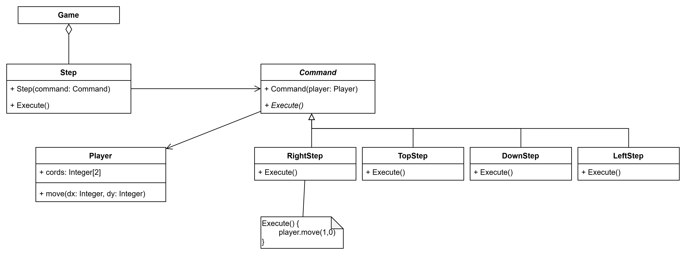
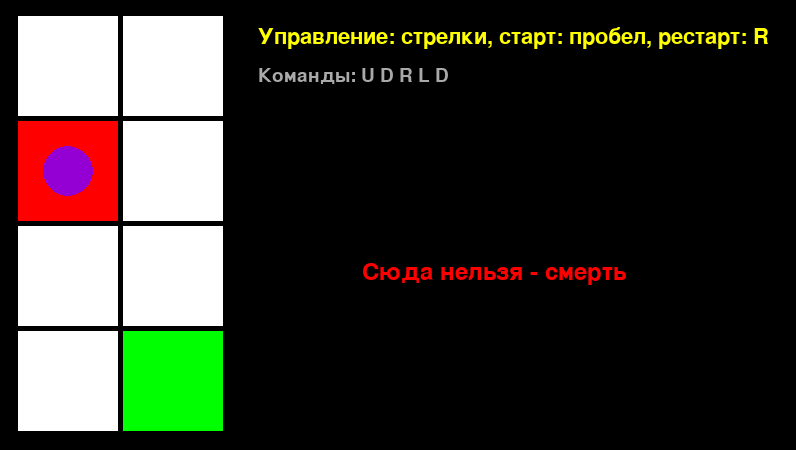

# Лабораторная работа №3
## Паттерн: Команда (Command)
### Описание
**Проблема:** Нам нужно хранить большое количество действий. Можно хранить все эти действия в списке, массиве или enum'е, но это невыгодно при масштабировании.

**Решение:** решением является паттерн команда. Он позволяет «упаковать» запрос в отдельный объект, в связи с чем можно передавать этот запрос как значение, или составлять очередь из действий, что помогает уменьшить сильную связность и убрать зависимость от конкретных операций.

---
### Реализация


_Рисунок 1 - диаграмма классов паттерна Command_

В паттерне есть 5 "участников", это:
- Command — абстрактная команда, которая предоставляет интерфейс для выполнения запроса. В моем случае это класс `Command`
- ConcreteCommand — это конкретные реализации команды (это `Right/Left/Top/DownStep`)
- Receiver — это получатель команды. Он определяет действия, которые должны выполняться в результате запроса (`Player`, он отвечает за передвижение игрока)
- Invoker — это инициатор команды, он вызывает команду для выполнения нужного запроса (в моем случае это `Step`)
- Client — создает команду и устанавливает получателя (`Game`)

---
В классе `Step` задается выполнение комманды, а в классе `Player` реализовано перемещение игрока

```py
class Step:
    def execute(self):
        self.command.execute()


class Player:
    def move(self, dx, dy):
        # ... 
```
___
В абстрактном классе `Command` определяется абстрактный метод `execute`, который в будущем перезаписывается в конкретных командах (`Right/Left/Top/DownStep`) 

```py
class Command(ABC):
    @abstractmethod
    def execute(self):
        pass


class RightStep(Command):
    def execute(self):
        self.player.move(1, 0)
# ...

class TopStep(Command):
    def execute(self):
        self.player.move(0, -1) 
```
___
В классе `Game` произведена вся отрисовка, управление и прочее взаимодействие с игрой

```py
class Game:
    def __init__(self):  # Инициализация переменных
        self.sc = pg.display.set_mode((800, 600))
        self.player = logic.Player()
        self.end = False
        self.dead = False
        self.steps: list[logic.Step] = []

        self.is_running = False
        self.last_step_time = 0
    
    def get_steps_text(self):
        # ...
    
    def reset(self):
        # ...

    def mainloop(self):  # Игровой цикл
        while True:
            if self.player.cords == [2, 4]:  # Проверка достижения финиша
                self.end = True
                self.is_running = False

            # Аналогичная проверка для смерти

            current_time = pg.time.get_ticks()

            if self.is_running and not self.end:  # Последовательное выполнение команд
                if len(self.steps):
                    if current_time - self.last_step_time >= 500:
                        self.steps.pop(0).execute()
                        self.last_step_time = current_time
                else:
                    self.is_running = False

            self.draw()

            for event in pg.event.get():  # Обработка событий (клавиатура)
                if event.type == pg.KEYDOWN and not self.end and not self.is_running:
                    if event.key == pg.K_LEFT:
                        self.steps.append(logic.Step(logic.LeftStep(self.player)))

                   # ...

                    elif event.key == pg.K_SPACE:
                        self.is_running = True
                        self.last_step_time = current_time

                if event.type == pg.QUIT:
                    exit()

    def draw(self):  # Отрисовка игрового поля, сообщений и персонажей
        self.sc.fill((0, 0, 0))

        if self.end:
            f1 = pg.font.Font(None, 36)
            text1 = f1.render("Конец", True, pg.Color("white"))
            self.sc.blit(text1, (364, 264))
            
        # Аналогично выводится сообщение о проигрыше

        for i in range(8):
                pg.draw.rect(
                    self.sc,  # ...
                )
    
        pg.draw.circle(
            self.sc,  # ...
        )
        
        info_font = pg.font.Font(None, 32)
        text = info_font.render(
            # ...
        )
        self.sc.blit(text, (260, 30))
        
        # Аналогично для последовательности команд
        
        pg.display.update()
```
---
### Игра
**Идея:** Мы задаем последовательность команд, которые отвечают за передвижение персонажем (вверх, вниз, влево, вправо), напрямую не взаимодействуя с персонажем. Нужно просто дойти до финиша

На рисунке 2 представлен вид игры



Вооот
---
### Реализация без паттерна
В реализации без паттерна все действия представлено объектом `Step`, в котором хранятся данные о перемещении (`dx`,`dy`), а все передвижение, по сути, лежит на методе `player.move(dx, dy)`
```py
class Step:
    def __init__(self, dx, dy):
        self.dx = dx
        self.dy = dy

    def execute(self, player):
        player.move(self.dx, self.dy)


class Player:
    def __init__(self):
        self.cords = [1, 1]

    def move(self, dx, dy):
        if 1 <= self.cords[0] + dx <= 2:
            self.cords[0] += dx
        if 1 <= self.cords[1] + dy <= 4:
            self.cords[1] += dy
```
___  
В реализации с паттерном список `steps` содержит объекты-команды, поэтому выполнение шага происходит через вызов `execute()` без дополнительных параметром.  реализации без паттерна в списке steps хранятся только смещения dx и dy, поэтому при выполнении шага необходимо явно передавать объект Player.

```py
class Game:
    def __init__(self):
        # ...

    def reset(self):
        # ...
        
    def get_steps_text(self):
        # ...

    def mainloop(self):
        while True:
            if self.player.cords == [2, 4]:
                self.end = True
                self.is_running = False

            # Аналогично для смерти

            current_time = pg.time.get_ticks()

            if self.is_running and not self.end:
                if len(self.steps):
                    if current_time - self.last_step_time >= 500:
                        self.steps.pop(0).execute(self.player)  # Step не хранит ссылку на Player, как реализация с паттерном
                        self.last_step_time = current_time
                else:
                    self.is_running = False

            self.draw()

            for event in pg.event.get():
                if event.type == pg.KEYDOWN and not self.end and not self.is_running:
                    if event.key == pg.K_LEFT:
                        self.steps.append(logic.Step(-1, 0))  # В отличии от реализации с паттерном, 
                                                              # здесь мы сохраняем данные о смещении
                        # ...
                    
                    elif event.key == pg.K_SPACE:
                        self.is_running = True 
                        self.last_step_time = current_time
    
                if event.type == pg.QUIT:
                    exit()
            
    def draw(self):
        self.sc.fill((0, 0, 0))

        # ...

        for i in range(8):
            pg.draw.rect(
                self.sc,
            # ...
            )

        pg.draw.circle(
            self.sc,
            # ...
        )

        info_font = pg.font.Font(None, 32)
        text = info_font.render(
            "Управление: стрелки, старт: пробел, рестарт: R", True, pg.Color("yellow")
        )
        self.sc.blit(text, (260, 30))

        # Аналогично для команд

        pg.display.update()
```
---
### Вывод
Использование паттерна позволило представить каждое действие игрока как отдельный объект-команду, уменьшить зависимость от конкретных операций и упростить расширение программы. Сравнение с реализацией без паттерна показало, что подход с командами делает архитектуру более гибкой и более удобной для масштабирования.

И вообще этот паттерн является супер крутым и удобным паттерном, который много где может пригодится, да и пригодится точно. Мне понравилось, спасибо.
