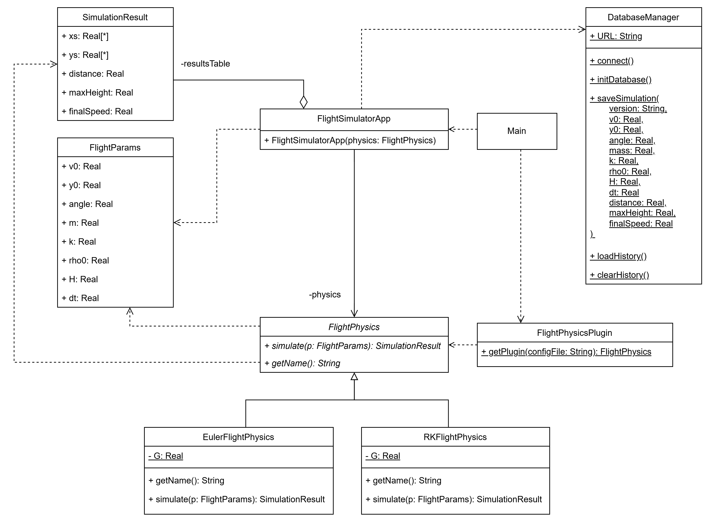

# Лабораторная работа №4
## Паттерн: Дополнительный модуль (Plugin)
### Описание
**Проблема:** В приложении необходимо добавить новый функционал. Если напрямую создавать нужный класс расчета в коде приложения, то придется изментять основную логику приложения. Это увеличивает связанность кода и усложняет его поддержку.

**Решение:** Использование паттерна Дополнительный модуль (Plugin) позволяет добавлять новый функционал в приложение без изменения основного кода. Новый функционал реализуется в виде отдельного модуля, который загружается и используется приложением.

---
### Реализация


_Рисунок 1 - диаграмма классов паттерна Plugin_

В паттерне определяются интерфейсы для загрузки и использования плагинов. В моем случае интерфейсом является абстрактный класс `FlightPhysics` - через него основная программа работает с разными реализациями расчета физики полета тела.

```java

public abstract class FlightPhysics {

    public abstract SimulationResult simulate(FlightParams p);

    public abstract String getName();
}
```
Метод `simulate` выполняет расчет физики полета тела, а метод `getName` возвращает название расчетной модели.
___

В классе `FlightPhysicsPlugin` реализуются методы для загрузки и использования плагинов.

```java
public class FlightPhysicsPlugin {

    public static FlightPhysics getPlugin(String configFile) {
        try {
            Properties props = new Properties();

            try (FileInputStream input = new FileInputStream(configFile)) {
                props.load(input);
            }

            String className = props.getProperty("FlightPhysics");

            Class<?> pluginClass = Class.forName(className);

            return (FlightPhysics) pluginClass
                .getDeclaredConstructor()
                .newInstance();
        } catch (Exception e) {
            e.printStackTrace();
            return null;
        }
    }
}
```
___

Классы `SimulationResult` и `FlightParams` являются моделями данных, используемыми для хранения параметров полета и результатов моделирования.

___
В классах `RKFlightPhysics` и `EulerFlightPhysics` реализуются расчеты физики полета с использованием методов Рунге-Кутты и Эйлера соответственно.

```java
public class RKFlightPhysics extends FlightPhysics {

    @Override
    public SimulationResult simulate(FlightParams params) {
        
    }

    @Override
    public String getName() {
        return "Runge-Kutta";
    }
}

public class EulerFlightPhysics implements FlightPhysics {

    @Override
    public SimulationResult simulate(FlightParams params) {
        
    }

    @Override
    public String getName() {
        return "Euler";
    }
}
```
___

В классе `DatabaseManager` реализуется работа с базой данных: создание таблиц, сохранение результатов моделирования и загрузка истории расчетов.
___
Классы `FlightSimulatorApp` и `Main` являются точками входа в приложение. В первом классе реализуется графический интерфейс, а во втором - запуск приложения.

---
### Реализация без паттерна

В реализации без паттерна используется другой пройденный нами паттерн под названием "Фабрика (Simple Factory)" 

> Ну вроде, я не совсем уверен

Суть такова: когда мы пытаемся внедрить новый модуль, мы создаем новый класс и даем знать об этом модуле фабрике, которая будет создавать его экземпляр.

```java
public class FlightPhysicsPlugin {

    public static FlightPhysics getPlugin(String method) {
        if (method == null) {
            return new EulerFlightPhysics();
        }

        return switch (method.toLowerCase()) {
            case "rk", "runge", "runge-kutta" -> new RKFlightPhysics(); // Тут создаем экземляры
            default -> new EulerFlightPhysics();
        };
    }
}
```
___
### Вывод

Нет выводов, все круто.
